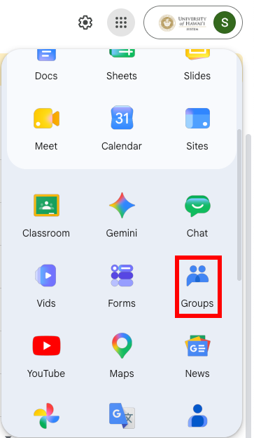
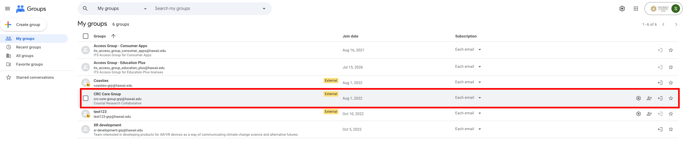
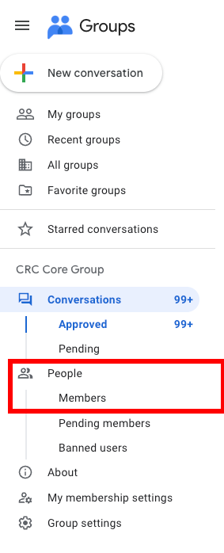
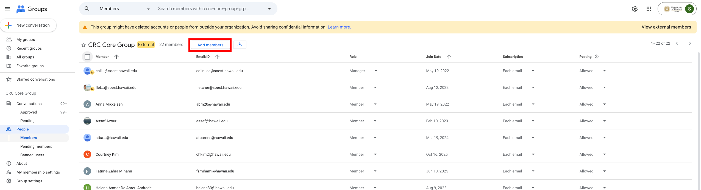
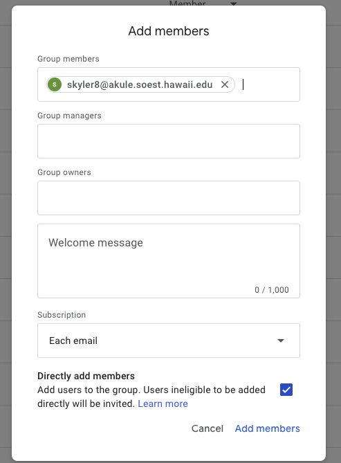
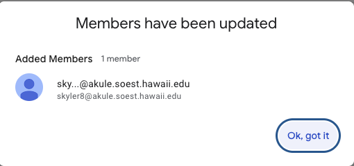
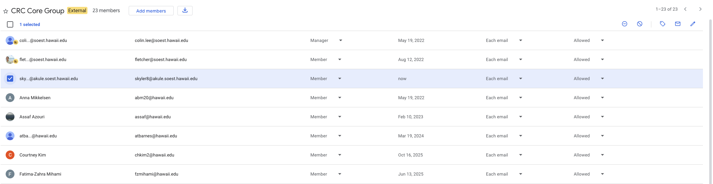
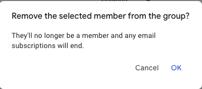

# Managing CRC Google Group Members

Note: You can only access this through your hawaii.edu account.

## Adding a User

1. Navigate to the [Google Groups Console](https://groups.google.com/u/1/)

2. Click on "CRC Core Group"
   - If "CRC Core Group" does not show up in your list, reach out to skyler8@hawaii.edu for access

3. On the left sidebar, navigate to the "Members" list

4. Click "Add members"

5. In the "Group members" field, enter the user's hawaii.edu email
   - To also give the user a manager or owner role, enter their email in the respective field

6. Click "Add members" in the pop-up modal

## Removing a User

1. Click on the user's row (the row will be highlighted when selected)

2. In the top right of the members table, click the remove icon

3. In the confirmation pop-up, click "OK"

